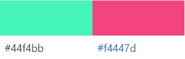

#  🤓 Quiz game "BRAINY" 🤓

---
 Quiz game Brainy is a Fun Facts based Trivia Quiz site aimed at people who enjoy the world of interesting facts and testing their knowledge as well as learning new things. It consists of 10 multiple choice questions with a Scoreboard, so you can test your IQ and discover new interesting things.

---

 The main purpose for creating this trivia is to provide users with an entertaining place to test their knowledge and discover new FunFacts.

 The information and quiz can be accessed and played on all devices.

---
### Fonts
* 'Mali' is the font used for this website and has been imported from Google fonts.

---
### UX
User Stories
* As a user, I want to:
  * be able to navigate the website easily.
  * understand the rules of the quiz before starting the game.
  * know how many questions there will be.
  * know my score during and after playing the quiz.

* As a site owner, I want:
  * the quiz to be easy and informative.
  * the questions to be short but informative
  * the website to be simple to navigate.
  * the user to get a feedback on their total score.

### Strategy
Project Purpose is 
* to provide user with informative and fun quiz questions.
* to make users learn something new in entertaining and easy way.

### Scope 
* a simple, straightforward UX experience.
* a bright and fun color scheme.
* clear content for all users.
* a site that is visually appealing on most devices.
* easy rules for the quiz.

### Structure
The game consists of welcome section, which explains the rules of the quiz to the user and provides the ability to create a username, quiz section with questions and options with answers, scoreboard, and score section, which shows final score and gives a feedback to the user.

### Skeleton and Surface
The idea of quiz design is "school". While building this quiz I was using Mali font, that looks like kid-writing. 

The webpage main image is bright, fun and nerdy.
The logo represents the aim of the website, matches the design idea and the name of the quiz.

# 🤓

The background image color of the website (#f4bb44) contrasts and complements with three main colors of the site elements. 

The website is simple without any distractive images, which gives user the ability to concentrate on answering questions and learn new things in an entertaining way. 

---

### Future features

  * Quiz section will have more available questions and a timer set for 60 seconds
  * score section will provide feedback for particular username

---
### Features
 * The welcome section explains the rules of the quiz to the user and provides the ability to create a username and a button to start the quiz.

* The quiz-section contains the info of the current number of question out of 10, the scoreboard, which shows how many right answers were given, question and 4 options of answers.

* The score-section shows how many right answers were given out of ten and provides feedback of knowledge level of the user in funny way.

