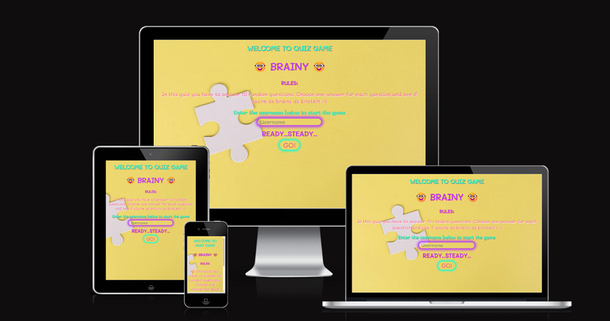
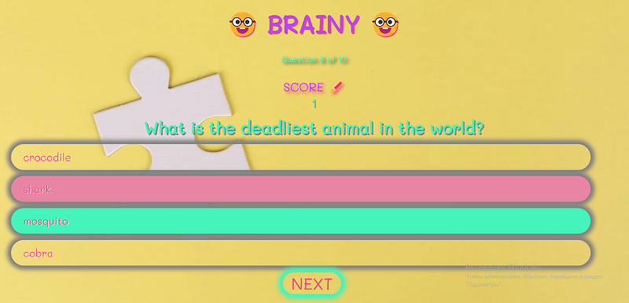
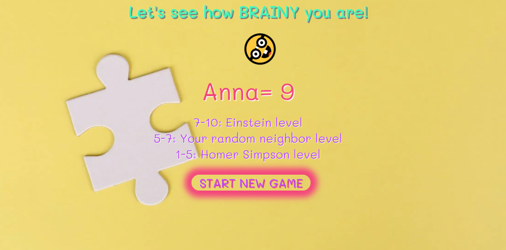

#  🤓 Quiz game "BRAINY" 🤓
---
The Live link to website can be found here - [BRAINY QUIZ](https://annatolchynska.github.io/brainy-quiz/)



---

 Quiz game Brainy is a Fun Facts based Trivia Quiz site aimed at people who enjoy the world of interesting facts and testing their knowledge as well as learning new things. It consists of 10 multiple choice questions with a Scoreboard, so you can test your IQ and discover new interesting things.

 The main purpose for creating this trivia is to provide users with an entertaining place to test their knowledge and discover new FunFacts.

 The information and quiz can be accessed and played on all devices.

---
### UX
User Stories
* As a user, I want to:
  * be able to navigate the website easily;
  * understand the rules of the quiz before starting the game;
  * know how many questions there will be;
  * know my score during and after playing the quiz.

* As a site owner, I want:
  * the quiz to be easy and informative;
  * the questions to be short and entertaining;
  * the website to be simple to navigate;
  * the user to get a feedback on their total score.

### Strategy
Project Purpose is 
* to provide user with informative and fun quiz questions;
* to make users learn something new in entertaining and easy way.

### Scope 
* a simple, straightforward UX experience;
* a bright and fun color scheme;
* clear content for all users;
* a site that is visually appealing on most devices;
* easy rules for the quiz.

### Structure
The game consists of welcome section, which explains the rules of the quiz to the user and provides the ability to create a username, quiz section with questions and options with answers, scoreboard, and score section, which shows final score and gives a feedback to the user.

### Skeleton and Surface
The idea of quiz design is "school". While building this quiz I was using Mali font, that looks like kid-writing. 

The webpage main image is bright, fun and nerdy.
The logo represents the aim of the website, matches the design idea and the name of the quiz.

# 🤓

The background image color of the website (#f4bb44) contrasts and complements with three main colors of the site elements. 


The website is simple without any distractive images, which gives user the ability to concentrate on answering questions and learn new things in an entertaining way. 

---

### Future features

* Quiz section will have more available questions and a timer set for 60 seconds;
* Users will have an opportunity to save their results.
    
---
### Features
 * The welcome section explains the rules of the quiz to the user and asks for a username in order to start the game.


* The quiz-section contains the info of the current number of question out of 10, the scoreboard, which shows how many right answers were given, question and 4 options of answers. Users are able to see if their answer was correct and if not the section shows which answer was correct.



* The score-section shows how many right answers were given out of ten and provides feedback of knowledge level of the user in funny way.


* The welcome back section contains invitation for the user who has alredy played to play again.


### Testing
   * This website works in different browsers: Chrome, Safari, Opera.
   * I made sure that the game is responsive and functions properly on all standart screen sizes by using devtools device toolbar.
   * I made sure that buttons and all set functions are responsive and work properly.

   ### Validator testing 
* HTML 
   
   * While testing site by HTML validator no errors were found.

   

* CSS
  
   * No errors were found passing through the official (Jigsaw) validator.

    

* JavaScript

    * While testing through JSHint 70 errors were found: about missing semicolons and errors on the ES6 features. They all were fixed by making sure that setting in "configures" "New JavaScript features (ES6)" is checked.


* Accessibility
   * I made sure that background and foreground colors have a sufficient contrast ratio and are appealing for user's eye, link text and alt text for images all have discernible names by running it through lighthouse in devtools.

   

   ---

   ###Bugs and Unfixed bugs
   * On the stage of testing the following error was showing on the console in the Devtools:

   .

   it was fixed by entering the following code in the head section of the html file: `<link rel="shortcut icon" href="#">`.
   * The score wasn't resetting properly, so I added this line of code to `startGame()` function `scoreText.innerText = score;` and it fixed the problem.
   * The start button was working from the second click. To fix this I rewrote the code from this: 

```js 

   document.getElementById('go').addEventListener('click', () => { 
 if (welcome.style.display === "block") {
        welcome.style.display = "none";
   } else {
       welcome.style.display = "block";
    }
    if (welcome.style.display === "none") {
       quiz.style.display = "block";
        startGame();`
    } else {
      quiz.style.display = "none";
   }
});

```
   to this: 

```js

   button.addEventListener('click', () => {
    welcome.style.display = 'none';
    quiz.style.display = 'block';
    startGame();
});

```

   * No other bugs were found.

   ### Deployment
* The site was deployed to GitHub pages by following steps:
   * Git Hub repository choose Settings tab and Pages
   * From drop down menu source section pick main Branch
   * once the Save button been clicked the page provided the link to the completed website.
The Live link can be found here - [BRAINY-QUIZ](https://annatolchynska.github.io/brainy-quiz/)

---
### Technology used
 * Languages
   
   * [HTML5](https://en.wikipedia.org/wiki/HTML5), [CSS3](https://en.wikipedia.org/wiki/CSS), [JavaScript](https://en.wikipedia.org/wiki/JavaScript) 
* Software
  
  * [Google Fonts](https://fonts.google.com/), [Gitpod](https://gitpod.io/), [Balsamiq](https://balsamiq.com/), [Github](https://github.com/), [Google Developer Tools](https://developer.chrome.com/docs/), [HTML color codes](https://htmlcolorcodes.com/), [Am I Responsive](http://ami.responsivedesign.is/)   

 * Testing

   * [HTML Validation](/assets/img/index-html-validator.png), [CSS Validation](/assets/img/css-validator.png), [JSHint Validation](/assets/img/jshint.png), Lighthouse. 

---
### Credits
* ### Content
  * The questions for the game were taken from [COSMOPOLITAN random facts](https://www.cosmopolitan.com/uk/worklife/a33367076/fun-facts-random/), [101 Fun Facts](https://parade.com/966564/parade/fun-facts/
), 
  * The code for picking questions, answers and score was taken from Youtube tutorial of Brian Design [How to Make a Quiz App using HTML CSS Javascript - Vanilla Javascript Project for Beginners Tutorial](https://www.youtube.com/watch?v=f4fB9Xg2JEY&t=3469s), some ideas for functions in js file were taken from [Build A Quiz App With JavaScript](https://www.youtube.com/watch?v=riDzcEQbX6k&t=1200s) by Web Dev Simplified, animation for emojis was taken from [How to Animate a Spinning Emoji with HTML & CSS | Basic Web Development Animation Tutorial](https://www.youtube.com/watch?v=tjGrSrCn_1U&t=513s) by Juni Learning.
  * Inspiration for some code ideas were taken from [W3schools](https://www.w3schools.com/default.asp), [stackoverflow](https://stackoverflow.com/), [developer.mozilla](https://developer.mozilla.org/en-US/), Slack community.
  * Emojis were copied from [Emoji terra](https://emojiterra.com/).
  * The background image was taken from [Pexels](https://www.pexels.com/).
